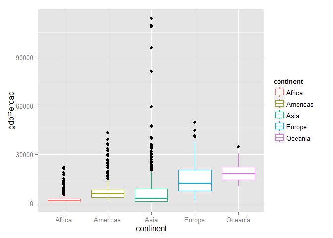

# Homework 02: Explore Gapminder and use R markdown


##Goal of this homework

* Explore a newly imported a dataset and establish workflows based on `data.frame`.
* Make plots with the package `ggplot2`.
* Learn how to author a dynamic report in R Markdown and share it on the web.

##Workflow

In this section, the entire workflow of importing the dataset and analyzing the data is reported.

###1. Input data

First, we need to import the [Gapminder excerpt](http://tiny.cc/gapminder) dataset into RStudio. Two functions - `read.delim()` and `read.table()` will be utilized to read the dataset.


```r
filePath <- "http://www.stat.ubc.ca/~jenny/notOcto/STAT545A/examples/gapminder/data/gapminderDataFiveYear.txt"
gapminderDelim <- read.delim(file = filePath)
dim(gapminderDelim)
```

```
## [1] 1704    6
```

The dataset could be successfully imported with `read.delim()`.


```r
gapminderTable <- read.table(file = filePath)
```

```
## Error in scan(file, what, nmax, sep, dec, quote, skip, nlines, na.strings, : 146行没有6元素
```

However, when using `read.table()` without specifying args other than `file`, it seems that we could not get the same resulting object as what we got with `read.delim()`. Particularly, when we read the dataset with `read.table()`, an error message will be displayed: "*Error in scan(file, what, nmax, sep, dec, quote, skip, nlines, na.strings, : line 146 did not have 6 elements*".

Therefore, it can be seen that without specifying certain args, we could not directly use `read.table()` to import the gapminder data. However, we can observe that each data entry in the given dataset is seperated by *tab* instead of *white space*. Thus, we should set the argument `sep` with the value of tab. Further, we should set `header = TRUE` since there is a header line in this dataset. But if we try the following line of code, there are only 1698 observations in `gapminderTable`, which is different from the 1704 observations in `gapminderDelim`. So there is still something wrong with the argument setting.


```r
gapminderTable <- read.table(file = filePath, header=TRUE, sep = "\t")
dim(gapminderTable)
```

```
## [1] 1698    6
```

In default argument setting, the character `'` is recognized as a quoting character. We may also need to disable this by setting `quote = "\""`. With all these argument settings, we will try to use `read.table()` to import the dataset again. 


```r
gapminderTable <- read.table(file = filePath, header=TRUE, sep = "\t", quote = "\"")
str(gapminderTable)
```

```
## 'data.frame':	1704 obs. of  6 variables:
##  $ country  : Factor w/ 142 levels "Afghanistan",..: 1 1 1 1 1 1 1 1 1 1 ...
##  $ year     : int  1952 1957 1962 1967 1972 1977 1982 1987 1992 1997 ...
##  $ pop      : num  8425333 9240934 10267083 11537966 13079460 ...
##  $ continent: Factor w/ 5 levels "Africa","Americas",..: 3 3 3 3 3 3 3 3 3 3 ...
##  $ lifeExp  : num  28.8 30.3 32 34 36.1 ...
##  $ gdpPercap: num  779 821 853 836 740 ...
```

This time, the gapminder data could be successfully imported.


```r
str(gapminderDelim)
```

```
## 'data.frame':	1704 obs. of  6 variables:
##  $ country  : Factor w/ 142 levels "Afghanistan",..: 1 1 1 1 1 1 1 1 1 1 ...
##  $ year     : int  1952 1957 1962 1967 1972 1977 1982 1987 1992 1997 ...
##  $ pop      : num  8425333 9240934 10267083 11537966 13079460 ...
##  $ continent: Factor w/ 5 levels "Africa","Americas",..: 3 3 3 3 3 3 3 3 3 3 ...
##  $ lifeExp  : num  28.8 30.3 32 34 36.1 ...
##  $ gdpPercap: num  779 821 853 836 740 ...
```

```r
sum(gapminderDelim != gapminderTable) #count the number of different entries in the two data.frames
```

```
## [1] 0
```

Comparing the outputs of `str(gapminderTable)` and `str(gapminderDelim)`, we can see that they give exactly the same results. Therefore, the dataset has been successfully imported with both functions.

###2. Smell test the data

After importing the dataset, some preliminary smell tests will be performed in order to explore the gapminder object.


```r
mode(gapminderDelim)
```

```
## [1] "list"
```

```r
class(gapminderDelim)
```

```
## [1] "data.frame"
```

```r
summary(gapminderDelim)
```

```
##         country          year           pop               continent  
##  Afghanistan:  12   Min.   :1952   Min.   :6.001e+04   Africa  :624  
##  Albania    :  12   1st Qu.:1966   1st Qu.:2.794e+06   Americas:300  
##  Algeria    :  12   Median :1980   Median :7.024e+06   Asia    :396  
##  Angola     :  12   Mean   :1980   Mean   :2.960e+07   Europe  :360  
##  Argentina  :  12   3rd Qu.:1993   3rd Qu.:1.959e+07   Oceania : 24  
##  Australia  :  12   Max.   :2007   Max.   :1.319e+09                 
##  (Other)    :1632                                                    
##     lifeExp        gdpPercap       
##  Min.   :23.60   Min.   :   241.2  
##  1st Qu.:48.20   1st Qu.:  1202.1  
##  Median :60.71   Median :  3531.8  
##  Mean   :59.47   Mean   :  7215.3  
##  3rd Qu.:70.85   3rd Qu.:  9325.5  
##  Max.   :82.60   Max.   :113523.1  
## 
```

The `gapminderDelim` object is a data.frame. From the R outputs above, it can be seen that its class is "data.frame", while its mode is "list". 

Also, from the outputs of `str(gapminderDelim)` in the previous section, we know that `gapminderDelim` contains 6 varibales (country, year, pop, continent, lifeExp, and gdpPercap) and 1704 rows/observations. Among these 6 varibales, there are 2 factors (country and continent), 1 int (year), and 3 nums (pop, lifeExp, and gdpPercap).

We can also get the information about the size of the `gapminderDelim` dataset in more than one way. For example, all of the following codes give information about the size and dimension of this dataset.

```r
nrow(gapminderDelim) #get the number of rows
ncol(gapminderDelim) #get the number of columns
length(gapminderDelim) #get the number of rows
dim(gapminderDelim) #get the number of rows and columns
```

Although generating similar results, these functions might be useful in different contexts. For example, if we are only interested in the number of rows of the data.frame, we might use `nrow()`. If we are only interested in the number of columns, we might use `ncol()` or `length()`. If we are interested in both the number of columns and rows, we might use `dim()`. If we also want to know about the composition of the data.frame, we might use `summary()` and `str()` to get more information.

###3. Explore individual variables

####Explore categorical variable: continent

First, we will pick up the categorical variable continent to explore its properties.


```r
str(gapminderDelim$continent)
```

```
##  Factor w/ 5 levels "Africa","Americas",..: 3 3 3 3 3 3 3 3 3 3 ...
```

```r
table(gapminderDelim$continent)
```

```
## 
##   Africa Americas     Asia   Europe  Oceania 
##      624      300      396      360       24
```

```r
barplot(table(gapminderDelim$continent))
```

 

We can see that the variable continent has 5 factor levels: Africa, Americas, Asia, Europe, and Oceania. From the bar plot above, it can also be seen that the gapminder dataset contains the largest amount of observations with the factor level Africa. In contrast, there are only few observations with the factor level "Oceania".

####Explore quantitative variable: gdpPercap

Next, we will explore the quantitative variable gapPercap.


```r
summary(gapminderDelim$gdpPercap)
```

```
##     Min.  1st Qu.   Median     Mean  3rd Qu.     Max. 
##    241.2   1202.0   3532.0   7215.0   9325.0 113500.0
```

```r
range(gapminderDelim$gdpPercap)
```

```
## [1]    241.1659 113523.1329
```

```r
hist(gapminderDelim$lifeExp)
```

 

We can see that the min value of gdpPercap is 241.1659, the max of gdpPercap is 113523.1329. Therefore, the range of the variable gdpPercap is [241.1659, 113523.1329]. Furthermore, from the histogram, we know that the distribution of gapPercap is asymmetric and skewed to the left, which is also shown by the fact that the mean of gdpPercap is larger than the median.


####Explore various plot types

In order to explore various plot types, first we need to include the packages `ggplot2` in our library.


```r
library(ggplot2)
```

```r
#Scatterplot of gdpPercap versus continent
ggplot(gapminderDelim, aes(x = continent, y = gdpPercap)) + 
  geom_point() + aes(color = continent)
```

 

```r
#In the scatterplot above, there is an overplotting problem, so we can try to make points spread out and plot again.
ggplot(gapminderDelim, aes(x = continent, y = gdpPercap)) + 
  geom_jitter(position = position_jitter(width = 0.2, height = 0)) + 
  aes(color = continent)
```

 

```r
#Boxplot of gdpPercap classified by continent
ggplot(gapminderDelim, aes(x = continent, y = gdpPercap)) + 
  geom_boxplot() + aes(color = continent)
```

 

```r
#Histogram of gdpPercap classified by year
ggplot(gapminderDelim, aes(gdpPercap)) + geom_histogram(bandwidth = 10) + 
  geom_density() + facet_wrap(~year)
```

 

```r
#Line chart of gdpPercap versus time for each country classified by continent
ggplot(gapminderDelim, aes(x = year, y = gdpPercap, group = country)) + 
  geom_line(show_guide = FALSE) + facet_wrap(~ continent) + aes(color = country)
```

 

####Further exploration on lifeExp

In this section, we will further explore the variable lifeExp and its relationship with other vairables.


```r
#Scatterplot of lifeExp versus gdpPercap
ggplot(gapminderDelim, aes(x = gdpPercap, y = lifeExp)) + 
  geom_point() + aes(color = continent)
```

 

```r
#Scatterplot of lifeExp versus log(gdpPercap)
ggplot(gapminderDelim, aes(x = gdpPercap, y = lifeExp)) + 
  geom_point() + scale_x_log10() + aes(color = continent)
```

 

From the above two plots, we can see that lifeExp has a strong linear relationship with gdpPercap. Taking into consideration the effect of other variables, a simple linear regression model for lifeExp is specified as `lifeExp ~ log(gdpPercap) + continent + year`.


```r
model1=lm(lifeExp ~ log(gdpPercap) + continent + year, data=gapminderDelim)
summary(model1)
```

```
## 
## Call:
## lm(formula = lifeExp ~ log(gdpPercap) + continent + year, data = gapminderDelim)
## 
## Residuals:
##      Min       1Q   Median       3Q      Max 
## -25.0433  -3.2175   0.3482   3.6657  15.1321 
## 
## Coefficients:
##                     Estimate Std. Error t value Pr(>|t|)    
## (Intercept)       -4.659e+02  1.667e+01  -27.94   <2e-16 ***
## log(gdpPercap)     5.024e+00  1.595e-01   31.50   <2e-16 ***
## continentAmericas  8.926e+00  4.630e-01   19.28   <2e-16 ***
## continentAsia      7.063e+00  3.959e-01   17.84   <2e-16 ***
## continentEurope    1.251e+01  5.097e-01   24.54   <2e-16 ***
## continentOceania   1.275e+01  1.275e+00   10.00   <2e-16 ***
## year               2.416e-01  8.586e-03   28.14   <2e-16 ***
## ---
## Signif. codes:  0 '***' 0.001 '**' 0.01 '*' 0.05 '.' 0.1 ' ' 1
## 
## Residual standard error: 5.813 on 1697 degrees of freedom
## Multiple R-squared:  0.7982,	Adjusted R-squared:  0.7975 
## F-statistic:  1119 on 6 and 1697 DF,  p-value: < 2.2e-16
```

From the model summaries, we can see that all the coefficients are significant. Also, the regression coefficient is 0.7982. Therefore, a significant part of the variation for the variable lifeExp could be explained via this simple regression model.

##Process report
This is the first time for me to use R Markdown and ggplot. So this homework really helps me a lot to have a better idea about how they work.

When I am not sure about the syntax of R Markdown, I refer to the cheatsheet provided by RStudio. Here are the links: [R Markdown Cheatsheet](https://www.rstudio.com/wp-content/uploads/2015/02/rmarkdown-cheatsheet.pdf) and [ggplot Cheatsheet](https://www.rstudio.com/wp-content/uploads/2015/03/ggplot2-cheatsheet.pdf). Also, the R help document helps a lot when I have problems about how to use certain R function. Simply typing `?`+*the name of the function* in the R Console will give all the infomation that might be used.
