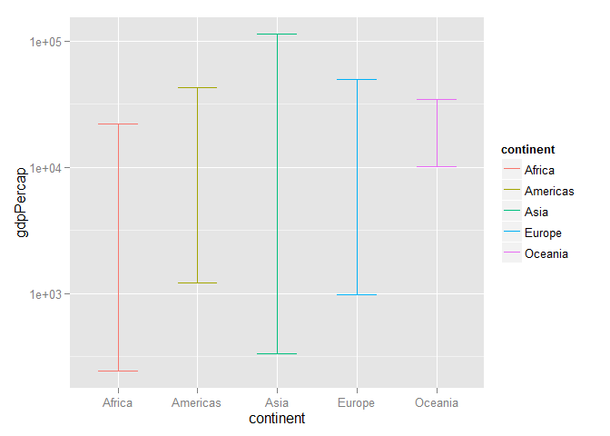
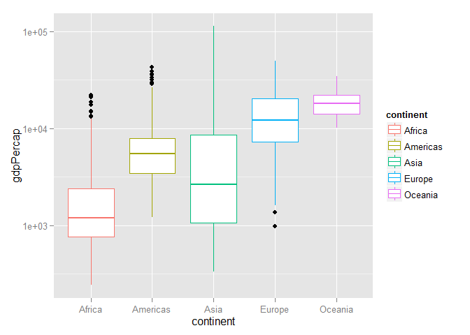
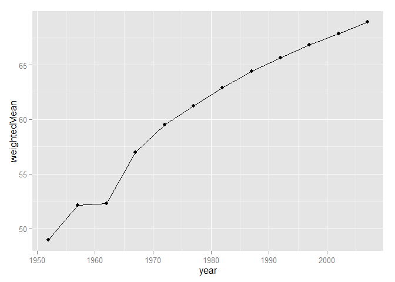
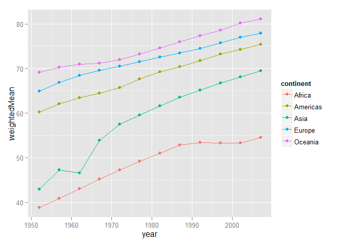
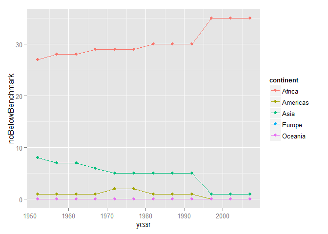
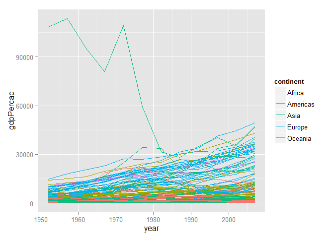
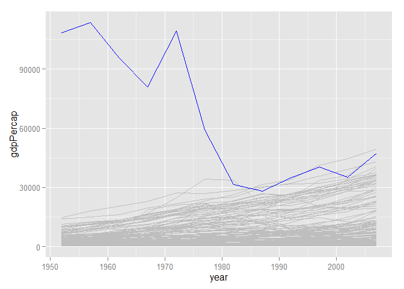
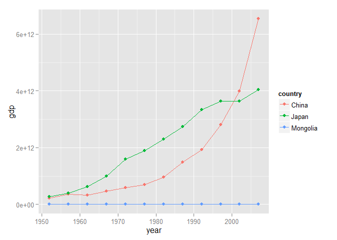

# Homework 03: Use dplyr to manipulate and explore data (also use ggplot2)
Shenyi Pan  


##Goal of this homework

* Manipulate and explore a dataset with the `dplyr` package.
* Continue to make plots with the package `ggplot2`.
* Learn how to author a dynamic report in R Markdown and share it on the web.

##Workflow

###Load data and packages
First, we need to load the gapminder data, as well as the `dplyr`, `ggplot2`, and `knitr` packages.


```r
library(gapminder)
suppressPackageStartupMessages(library(dplyr))
library(ggplot2)
library(knitr)
```

###Tasks

####1. Get the maximum and minimum of GDP per capita for all continents
We will group the gapminder dataset by continent, and then summarize it to obtain the minimum and the maximum of gdpPercap for each continent. The error bar plot shows these maximum and minimum values.

```r
minMaxGdpPercap <- gapminder %>% group_by(continent) %>% 
  summarize(min_gdpPercap = min(gdpPercap), max_gdpPercap = max(gdpPercap))
kable(minMaxGdpPercap, format="markdown")
```


|continent | min_gdpPercap| max_gdpPercap|
|:---------|-------------:|-------------:|
|Africa    |      241.1659|      21951.21|
|Americas  |     1201.6372|      42951.65|
|Asia      |      331.0000|     113523.13|
|Europe    |      973.5332|      49357.19|
|Oceania   |    10039.5956|      34435.37|

```r
ggplot(minMaxGdpPercap) + 
  geom_errorbar(aes(x=continent, ymin=min_gdpPercap, ymax=max_gdpPercap, color=continent, width=.5)) + scale_y_log10() + ylab("gdpPercap")
```

 

From the figure, we can see that most continents, the difference between the maximum GDP per capita and minimum GDP per capita is quite large. Oceania has the smallest difference perhaps due to the few number of observations we have.

####2. Look at the spread of GDP per capita within the continents
We will group the gapminder dataset by continent, and then summarize it to obtain the interquantile range, standard deviation, minimum, median, as well as maximum for each continent. We can use box plot to visualize all the information.


```r
spreadGdpPercap <- gapminder %>% group_by(continent) %>% 
  summarize(IQR = IQR(gdpPercap), sd = sd(gdpPercap), min = min(gdpPercap), median = median(gdpPercap), max = max(gdpPercap))
kable(spreadGdpPercap, format="markdown")
```


|continent |       IQR|        sd|        min|    median|       max|
|:---------|---------:|---------:|----------:|---------:|---------:|
|Africa    |  1616.170|  2827.930|   241.1659|  1192.138|  21951.21|
|Americas  |  4402.431|  6396.764|  1201.6372|  5465.510|  42951.65|
|Asia      |  7492.262| 14045.373|   331.0000|  2646.787| 113523.13|
|Europe    | 13248.301|  9355.213|   973.5332| 12081.749|  49357.19|
|Oceania   |  8072.258|  6358.983| 10039.5956| 17983.304|  34435.37|

```r
ggplot(gapminder) + geom_boxplot(aes(x=continent, y=gdpPercap, color=continent)) + scale_y_log10()
```

 

From the box plot above, we can see that the distribution of GDP per capita of Asia and Africa has larger spread than the other three continents. The distribution of most continents are skewed to the right except Europe.

####3. Compute a weighted mean of life expectancy by population for different years
We will group the gapminder dataset by different years, and then summarize it to obtain the weighted mean of lifeExp by population. Then we can use a line plot to visualize the change of weighted mean of lifeExp over time.

```r
weightedMean <- gapminder %>% group_by(year) %>% 
  summarize(weightedMean = sum(lifeExp*pop)/(sum(pop)))
kable(weightedMean, format="markdown")
```


| year| weightedMean|
|----:|------------:|
| 1952|     48.94424|
| 1957|     52.12189|
| 1962|     52.32438|
| 1967|     56.98431|
| 1972|     59.51478|
| 1977|     61.23726|
| 1982|     62.88176|
| 1987|     64.41635|
| 1992|     65.64590|
| 1997|     66.84934|
| 2002|     67.83904|
| 2007|     68.91909|

```r
ggplot(weightedMean) + geom_line(aes(x=year, y=weightedMean)) + geom_point(aes(x=year, y=weightedMean))
```

 

From the above line plot, we can see that the genral trend of weighted mean of life expectancy by population is increasing with years.

####4. How is life expectancy changing over time on different continents?
We will group the gapminder dataset by both continents and years. And then use line plot to examine how the weighted average of lifeExp changes over time acress different continents. Since the result table has quite a few rows, we will only show the first few rows here.

```r
lifeExpOverTime <- gapminder %>% group_by(continent, year) %>% 
  summarize(weightedMean = sum(lifeExp*pop)/(sum(pop)))  
kable(head(lifeExpOverTime), format="markdown")
```


|continent | year| weightedMean|
|:---------|----:|------------:|
|Africa    | 1952|     38.79973|
|Africa    | 1957|     40.94031|
|Africa    | 1962|     43.09925|
|Africa    | 1967|     45.17721|
|Africa    | 1972|     47.21229|
|Africa    | 1977|     49.20883|

```r
ggplot(lifeExpOverTime) + geom_line(aes(x=year, y=weightedMean, color=continent)) + 
  geom_point(aes(x=year, y=weightedMean, color=continent)) 
```

 

From the above line plot, we can see that for all continents, the genral trend of weighted mean of life expectancy by population is increasing with years. However, after 1992, the life expectancy of Africa tends to increase at a lower speed than other continents.

####5. Report the absolute abundance of countries with low life expectancy over time by continent
*Compute some measure of worldwide life expectancy – you decide – a mean or median or some other quantile or perhaps your current age. Then determine how many countries on each continent have a life expectancy less than this benchmark, for each year.*

To answer this question, first we have to find a benchmark for lifeExp. We will use the lower 25% quantile for global lifeExp in certain year as the benchmark for that year. After finding the benchmark, we will find the number of the countries that fall below the benchmark each year.

Since the result table reporting the absolute abundance of countries with low life expectancy over time by continent has quite a few rows, we will only show the first few rows here.


```r
lifeExpBenchmark <- gapminder %>% group_by(year) %>% 
  summarize(benchmark = quantile(lifeExp, .25))
kable(lifeExpBenchmark, format="markdown")
```


| year| benchmark|
|----:|---------:|
| 1952|  39.05900|
| 1957|  41.24750|
| 1962|  43.46850|
| 1967|  46.03375|
| 1972|  48.50025|
| 1977|  50.47550|
| 1982|  52.94000|
| 1987|  54.94075|
| 1992|  56.12175|
| 1997|  55.63375|
| 2002|  55.52225|
| 2007|  57.16025|

```r
gapminder2 <- gapminder %>% mutate(benchmark = rep(lifeExpBenchmark$benchmark, nlevels(country)))
noBelowBenchmark <- gapminder2 %>% 
  group_by(continent, year) %>% summarize(noBelowBenchmark = sum(benchmark > lifeExp))
kable(head(noBelowBenchmark, 12), format="markdown")
```


|continent | year| noBelowBenchmark|
|:---------|----:|----------------:|
|Africa    | 1952|               27|
|Africa    | 1957|               28|
|Africa    | 1962|               28|
|Africa    | 1967|               29|
|Africa    | 1972|               29|
|Africa    | 1977|               29|
|Africa    | 1982|               30|
|Africa    | 1987|               30|
|Africa    | 1992|               30|
|Africa    | 1997|               35|
|Africa    | 2002|               35|
|Africa    | 2007|               35|

```r
ggplot(noBelowBenchmark) + geom_line(aes(x=year, y=noBelowBenchmark, color=continent)) + 
  geom_point(aes(x=year, y=noBelowBenchmark, color=continent))
```

 

From the line plot above, we can see that Africa has the most countries with low life expectancy, and the number of countries with low life expectancy in Africa even has a tendency to increase during recent years.

####6. Find countries with interesting stories

We will take a look at the the plot of the change of GDP per capita over different years,


```r
ggplot(gapminder) + geom_line(aes(x = year, y = gdpPercap, group = country, color = continent))
```

 

From the plot above, we can see that there is a country with extremely high GDP per capita in 1950s, but then its GDP per capita rapidly droppoed in the next few decades. So who is that country?


```r
gapminder %>% filter(year == min(year)) %>% select(country, year, gdpPercap) %>%
  arrange(desc(gdpPercap)) %>% head(10) %>% kable(format="markdown")
```


|country        | year|  gdpPercap|
|:--------------|----:|----------:|
|Kuwait         | 1952| 108382.353|
|Switzerland    | 1952|  14734.233|
|United States  | 1952|  13990.482|
|Canada         | 1952|  11367.161|
|New Zealand    | 1952|  10556.576|
|Norway         | 1952|  10095.422|
|Australia      | 1952|  10039.596|
|United Kingdom | 1952|   9979.508|
|Bahrain        | 1952|   9867.085|
|Denmark        | 1952|   9692.385|

That country seems to be Kuwait. We will use another line plot to show the contrast of the change in GDP per capita between Kuwait and other countries.


```r
ggplot(data = filter(gapminder, country != "Kuwait")) + 
  geom_line(aes(x = year, y = gdpPercap, group = country), color="grey") + 
  geom_line(data = filter(gapminder, country == "Kuwait"), color = "blue", aes(x = year, y = gdpPercap))
```

 

So from the plot we can see the GDP per capita of Kuwait rapidly decreased after 1972, but still ranked as one of the hight GDP per capita around the world.

####7. Make up your own!

In this section, we will examine which country is the largest economy and which country is the smallest economy in Asia over years.


```r
gdpInAsia <- gapminder %>% mutate(gdp = pop * gdpPercap) %>% 
  filter(continent == 'Asia') %>% arrange(year) %>% group_by(year) %>% 
  mutate(gdp_rank = min_rank(gdp), gdp_desc_rank = min_rank(desc(gdp))) %>% 
  filter(min_rank(desc(gdp)) < 2 | min_rank(gdp) < 2) %>% 
  select(country, year, pop, gdpPercap, gdp, gdp_desc_rank)
kable(gdpInAsia, format="markdown")
```


|country  | year|        pop|  gdpPercap|          gdp| gdp_desc_rank|
|:--------|----:|----------:|----------:|------------:|-------------:|
|Japan    | 1952|   86459025|  3216.9563| 2.781349e+11|             1|
|Mongolia | 1952|     800663|   786.5669| 6.297750e+08|            33|
|Japan    | 1957|   91563009|  4317.6944| 3.953411e+11|             1|
|Mongolia | 1957|     882134|   912.6626| 8.050907e+08|            33|
|Japan    | 1962|   95831757|  6576.6495| 6.302519e+11|             1|
|Mongolia | 1962|    1010280|  1056.3540| 1.067213e+09|            33|
|Japan    | 1967|  100825279|  9847.7886| 9.929060e+11|             1|
|Mongolia | 1967|    1149500|  1226.0411| 1.409334e+09|            33|
|Japan    | 1972|  107188273| 14778.7864| 1.584113e+12|             1|
|Mongolia | 1972|    1320500|  1421.7420| 1.877410e+09|            33|
|Japan    | 1977|  113872473| 16610.3770| 1.891465e+12|             1|
|Mongolia | 1977|    1528000|  1647.5117| 2.517398e+09|            33|
|Japan    | 1982|  118454974| 19384.1057| 2.296144e+12|             1|
|Mongolia | 1982|    1756032|  2000.6031| 3.513123e+09|            33|
|Japan    | 1987|  122091325| 22375.9419| 2.731908e+12|             1|
|Mongolia | 1987|    2015133|  2338.0083| 4.711398e+09|            33|
|Japan    | 1992|  124329269| 26824.8951| 3.335120e+12|             1|
|Mongolia | 1992|    2312802|  1785.4020| 4.129281e+09|            33|
|Japan    | 1997|  125956499| 28816.5850| 3.629636e+12|             1|
|Mongolia | 1997|    2494803|  1902.2521| 4.745744e+09|            33|
|China    | 2002| 1280400000|  3119.2809| 3.993927e+12|             1|
|Mongolia | 2002|    2674234|  2140.7393| 5.724838e+09|            33|
|China    | 2007| 1318683096|  4959.1149| 6.539501e+12|             1|
|Mongolia | 2007|    2874127|  3095.7723| 8.897643e+09|            33|

From the above table, we can see that Mongolia has been the smallest economy in Asia for all the selected years. Meanwhile, Japan was Asia's largest economy until the year 1997, which was exceeded by China in 2002. The change of total GDP over years for these three counrties can be found below.


```r
ggplot(gapminder %>% mutate(gdp = pop * gdpPercap) %>% filter(country == "China" | country == "Japan" | country == "Mongolia")) + 
  geom_line(aes(x = year, y = gdp, color = country)) + geom_point(aes(x = year, y = gdp, color = country))
```

 

##Process report
This is the first time I use the package `dplyr`. So this homework helps me to have a better idea about how this package works. 

Also, I was trying to use the sharing on [Stack Overflow](http://stackoverflow.com/questions/19237190/2-column-report-in-r-markdown-render-html-aside-data-frame) to get the table and figure side-by-side. It worked perfectly on my laptop when I clicked on "Knit HTML". But when I uploaded the md file to github, it could not display the tables and figures correctly. So I still use the plain way to display the figures as well as tables.
