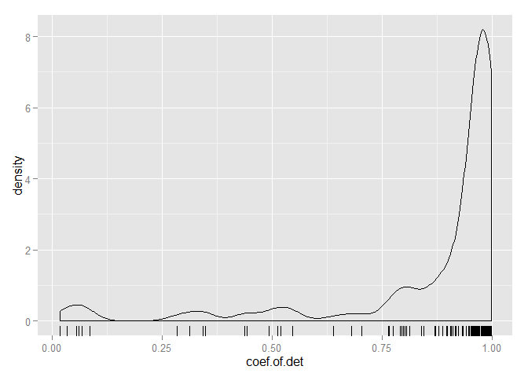
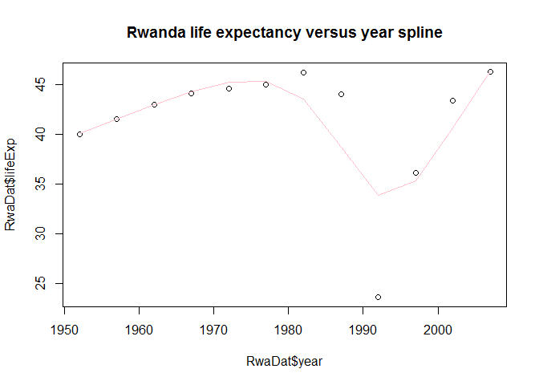

# Homework 04: Use split-apply-combine with your functions within data.frames
Shenyi Pan  


##Goal of this homework

* Write custom functions that do something useful to pieces of the Gapminder data
* Use `dplyr::do()` to apply to all such pieces
* Use `dplyr()` and `ggplot2` to explore the results

##Workflow

###Load data and packages
First, we need to load the gapminder data, as well as the `dplyr`, `ggplot2`, and `knitr` packages.


```r
library(gapminder)
suppressPackageStartupMessages(library(dplyr))
library(ggplot2)
library(knitr)
```

###Elementary analysis on life expectancy

In this homework, we will explore the relationship between life expectancy and time, that is, how the life expectancy of a certain country changes with time. First, we will plot the expectancy against time in order to check the general trend.


```r
ggplot(aes(x = year, y = lifeExp, color = country), data = gapminder) + geom_line() +  facet_wrap(~continent) + theme(legend.position="none")
```

 

From the plot above, it can be seen that for most countries, the life expectancy changes linearly with years. Therefore, a linear regression model might be a suitable choice for most of the countries we have. However, it is also noticeable that there are a few countries with drastic and irregular change patterns over years. For those countries, if we simply fit a linear regression model, it will lead to large residuals. Thus, we may consider those countries with large regression residuals as potential countries with interesting stories.

We will first fit a linear regression model to one specific country as a trial experiment.


```r
sampleCountry <- "Indonesia"
indoDat <- gapminder %>% filter(country == sampleCountry)
kable(indoDat, format="markdown")
```


|country   |continent | year| lifeExp|       pop| gdpPercap|
|:---------|:---------|----:|-------:|---------:|---------:|
|Indonesia |Asia      | 1952|  37.468|  82052000|  749.6817|
|Indonesia |Asia      | 1957|  39.918|  90124000|  858.9003|
|Indonesia |Asia      | 1962|  42.518|  99028000|  849.2898|
|Indonesia |Asia      | 1967|  45.964| 109343000|  762.4318|
|Indonesia |Asia      | 1972|  49.203| 121282000| 1111.1079|
|Indonesia |Asia      | 1977|  52.702| 136725000| 1382.7021|
|Indonesia |Asia      | 1982|  56.159| 153343000| 1516.8730|
|Indonesia |Asia      | 1987|  60.137| 169276000| 1748.3570|
|Indonesia |Asia      | 1992|  62.681| 184816000| 2383.1409|
|Indonesia |Asia      | 1997|  66.041| 199278000| 3119.3356|
|Indonesia |Asia      | 2002|  68.588| 211060000| 2873.9129|
|Indonesia |Asia      | 2007|  70.650| 223547000| 3540.6516|

```r
ggplot(indoDat, aes(x = year, y = lifeExp)) + geom_point() + geom_smooth(method = "lm", se = FALSE)
```

 

So we can see that the linear regression model works well for the Indonesia data.

###Writing the function

In this part, we will write some functions to analyze the life expectancy data. First of all, we will write the function to fit a linear regression model to life expectancy versus year. 

Before writing the function, we should first determine what values to return with this function. Ideally, this function should return the following values:

- Coefficient for the intercept as well as the slope in the fitted regression model;
- The maximum of the absolute value of the regression residual, as well as the year that largest residual corresponds to;
- Coefficient of determination, which is a measure of whether the fitted regression model is good or not.

At the beginning of the function, we would also wish to check whether we are receiving a dame frame. If it is not the case, we will terminate the function. Bearing these thoughts in mind, we will write the function as follows:


```r
linearModel <- function (dat, offset = 1952){
  #make sure that we are receiving a dame frame
  stopifnot(is.data.frame(dat))
  #fit a linear regression model
  linMod <- lm(lifeExp ~ I(year - offset), data = dat)
  #find the maximum absolute residual
  maxRes <-  max(abs(linMod$residuals))
  #find which year that residual corresponds to
  maxResYear <- offset - 5 + 5*which.max(abs(linMod$residuals))
  #store the coefficient of determination
  R2 <- summary(linMod)$r.squared
  returnDat <- c(linMod$coef, maxRes, maxResYear, R2)
  return(setNames(data.frame(t(returnDat)), c("intercept", "slope", "max.abs.res", "res.year", "coef.of.det")))
}
```

The returned value `max.abs.res`, `res.year`, and `coef.of.det` represents the maximum of the absolute value of the regression residual, the year that largest residual occurs, and the coefficient of determination respectively. Let us try the function on the Indonesia data.


```r
linearModel(indoDat)
```

```
##   intercept     slope max.abs.res res.year coef.of.det
## 1  36.88312 0.6346413    1.138385     2007   0.9971142
```

So we can see that the function indeed works for the Indonesia data.

Apart from the ordinary least squares linear regression model, we may also wish to fit a robust regression model. Similarly, we can write another function for the robust regression case.


```r
robustModel <- function (dat, offset = 1952){
  #make sure that we are receiving a dame frame
  stopifnot(is.data.frame(dat))
  #fit a robust regression model
  robMod <- robMod <- lmrob(lifeExp ~ I(year - offset), data = dat)
  #find the maximum absolute residual
  maxRes <-  max(abs(robMod$residuals))
  #find which year that residual corresponds to
  maxResYear <- offset - 5 + 5*which.max(abs(robMod$residuals))
  #store the coefficient of determination
  R2 <- summary(robMod)$r.squared
  returnDat <- c(robMod$coef, maxRes, maxResYear, R2)
  return(setNames(data.frame(t(returnDat)), c("intercept", "slope", "max.abs.res", "res.year", "coef.of.det")))
}
```


```r
library(robustbase)
robustModel(indoDat)
```

```
##   intercept     slope max.abs.res res.year coef.of.det
## 1  36.82399 0.6373399    1.227688     2007   0.9969132
```

So we can see that the function works for the Indonesia data as well.

Next we will write a function that gives both the regression coefficient estimate from both regression models, as well as the difference between the estimated parameters under these two approaches.


```r
modelDiff <- function (dat, offset = 1952){
  #make sure that we are receiving a dame frame
  stopifnot(is.data.frame(dat))
  #fit a linear regression model
  linMod <- lm(lifeExp ~ I(year - offset), data = dat)
  #fit a robust regression model
  robMod <- lmrob(lifeExp ~ I(year - offset), data = dat)
  returnDat <- c(linMod$coef, robMod$coef, robMod$coef-linMod$coef)
  return(setNames(data.frame(t(returnDat)), c("lm.intercept", "lm.slope", "rob.intercept", "rob.slope", "intercept.change", "slope.change")))
}
```

The returned value `intercept.change`, `slope.change` stands for the change of the estimated intercept and slope respectively compared with linear regression model when we switch from linear regression to robust regression model. Let us try the function on the Indonesia data.


```r
modelDiff(indoDat)
```

```
##   lm.intercept  lm.slope rob.intercept rob.slope intercept.change
## 1     36.88312 0.6346413      36.82399 0.6373399      -0.05912077
##   slope.change
## 1  0.002698618
```

So again we can see that the function works for the Indonesia data. We can also notice that the discrepancy of the estimated regression coefficients between the two regression approaches is very small. So there is actually no significant differences between the two methods for the Indonesia data.

###Applying the function to the gapminder dataset

After writing the functions, we will apply them to all countries in the gapminder dataset by placing the function inside a `dplyr::do()` call. First we will apply the function `linearModel()` that we write in the previous section. 15 random rows of the result table will be shown below.


```r
lmFitResult <- gapminder %>%
  group_by(continent, country) %>% 
  do(linearModel(.)) %>%
  ungroup()
set.seed(13)
kable(lmFitResult[sample(nrow(lmFitResult), 15), ], format="markdown")
```


|continent |country             | intercept|     slope| max.abs.res| res.year| coef.of.det|
|:---------|:-------------------|---------:|---------:|-----------:|--------:|-----------:|
|Asia      |Philippines         |  49.40435| 0.4204692|   1.6523462|     1952|   0.9914226|
|Africa    |Namibia             |  47.13433| 0.2311636|   7.2135152|     2002|   0.4370216|
|Americas  |Brazil              |  51.51204| 0.3900895|   0.5950385|     1952|   0.9980474|
|Africa    |Cote d'Ivoire       |  44.84586| 0.1305566|   5.2396585|     1987|   0.2833724|
|Europe    |Serbia              |  61.53435| 0.2551510|   3.5383462|     1952|   0.8788054|
|Africa    |Angola              |  32.12665| 0.2093399|   2.1228497|     1977|   0.8878146|
|Asia      |Bahrain             |  52.74921| 0.4675077|   2.8271282|     2007|   0.9667398|
|Asia      |Sri Lanka           |  59.79149| 0.2448944|   2.1984872|     1952|   0.9477147|
|Europe    |Denmark             |  71.03359| 0.1213301|   0.6252564|     2007|   0.9706680|
|Africa    |Burundi             |  40.57864| 0.1541343|   2.2683310|     1982|   0.7659960|
|Asia      |Israel              |  66.30041| 0.2671063|   0.9104103|     1952|   0.9947829|
|Europe    |Croatia             |  63.85578| 0.2254594|   2.6457821|     1952|   0.9324305|
|Europe    |Portugal            |  61.14679| 0.3372014|   1.5948718|     2007|   0.9690351|
|Americas  |Trinidad and Tobago |  62.05231| 0.1736615|   2.9523077|     1952|   0.7980074|
|Americas  |Uruguay             |  65.74160| 0.1832720|   0.8424033|     1977|   0.9768307|

```r
#Calculate the proportion of countries with coefficient of determination greater than 0.6
lmFitResult %>% filter(coef.of.det > .6) %>% nrow() / nrow(lmFitResult)
```

```
## [1] 0.8802817
```

For most countries, we can see that around 90% of the countries have a regression coefficient pf determination greater than 0.6, which indicates that the simple linear regression model works well for most of the countries. This is also shown by the plot of the density of the regression R^2 we get. However, there are also some countries where the fitted linear regression model does not work so well. Therefore, we get a very long left tail in the density plot.


```r
ggplot(lmFitResult, aes(x = coef.of.det)) + geom_density() + geom_rug()
```

 

Likewise, we can make a plot of the maximum absolute residual we get from all the regression models. Again, for most countries, the maximum absolute residual is not so extreme. However, there are indeed countries with very large residuals, which indicates that for those countries the linear regression model does not perform that well.


```r
ggplot(lmFitResult, aes(x = max.abs.res)) + geom_density() + geom_rug()
```

 

We can also make a plot to check the relationship between slope and intercept estimates from the regression model. From the plot, it can be seen that generally slope and intercept are negatively correlated. We know that the intercept stands for the life expectancy in the year 1952, while the slope stands for the change of life expectancy when year increases by 1. So the result makes sense since if a country already has a high life expectanct in 1952, it will have less room to improve over the following years than those with a low start.


```r
ggplot(lmFitResult, aes(x = intercept, y = slope)) + geom_point() + geom_smooth(se = FALSE)
```

 

We can also apply the function `robustModel()` that we write to check whether anything changes.


```r
robFitResult <- gapminder %>%
  group_by(continent, country) %>% 
  do(robustModel(.)) %>%
  ungroup()
set.seed(13)
kable(robFitResult[sample(nrow(robFitResult), 15), ], format="markdown")
```


|continent |country             | intercept|     slope| max.abs.res| res.year| coef.of.det|
|:---------|:-------------------|---------:|---------:|-----------:|--------:|-----------:|
|Asia      |Philippines         |  50.13270| 0.4016670|   2.3806992|     1952|   0.9959221|
|Africa    |Namibia             |  42.88653| 0.5154916|  18.3325653|     2007|   0.9842745|
|Americas  |Brazil              |  51.72278| 0.3872508|   0.8057785|     1952|   0.9992088|
|Africa    |Cote d'Ivoire       |  41.17904| 0.3895739|  14.2775972|     2007|   0.9170058|
|Europe    |Serbia              |  64.56470| 0.1775679|   6.5686993|     1952|   0.9185645|
|Africa    |Angola              |  32.18660| 0.2069345|   2.1716004|     1952|   0.8738785|
|Asia      |Bahrain             |  52.37402| 0.4891869|   3.6443024|     2007|   0.9698098|
|Asia      |Sri Lanka           |  60.25936| 0.2321132|   2.6663590|     1952|   0.9484504|
|Europe    |Denmark             |  71.04218| 0.1205568|   0.6591974|     2007|   0.9686961|
|Africa    |Burundi             |  39.22366| 0.2644418|   5.7975449|     1997|   0.9906515|
|Asia      |Israel              |  66.67906| 0.2571894|   1.2890568|     1952|   0.9989659|
|Europe    |Croatia             |  65.08751| 0.1932839|   3.8775074|     1952|   0.9674197|
|Europe    |Portugal            |  61.15008| 0.3373154|   1.6044330|     2007|   0.9640021|
|Americas  |Trinidad and Tobago |  62.28529| 0.1679422|   3.1852915|     1952|   0.7627862|
|Americas  |Uruguay             |  65.79630| 0.1825753|   0.8796816|     1977|   0.9767479|

```r
#Calculate the proportion of countries with coefficient of determination greater than 0.6
robFitResult %>% filter(coef.of.det > .6) %>% nrow() / nrow(robFitResult)
```

```
## [1] 0.9647887
```

So after we fit a robust regression model, over 96% of the countries have a regression coefficient pf determination greater than 0.6, which performs even better than the linear regression case. We will also make the density plot for the coefficient of regression we obtained via robust regression.


```r
ggplot(robFitResult, aes(x = coef.of.det)) + geom_density() + geom_rug()
```

 

As is seen from the density plot above, robust regression significantly reduces the number of cases where extreme low coefficient of determination occurs. The entire ditribution of R^2 under robust regression is more concentrated to the right.

So in the next part, we will take a further look at the ten worst models suggested based on the coefficient of determination in linear regression model, and check whether fitting a robust regression model improves the performance.


```r
badFit <- lmFitResult %>% arrange(coef.of.det)
kable(head(badFit,10), format="markdown")
```


|continent |country          | intercept|      slope| max.abs.res| res.year| coef.of.det|
|:---------|:----------------|---------:|----------:|-----------:|--------:|-----------:|
|Africa    |Rwanda           |  42.74195| -0.0458315|   17.309690|     1992|   0.0171596|
|Africa    |Botswana         |  52.92912|  0.0606685|    9.328542|     2002|   0.0340234|
|Africa    |Zimbabwe         |  55.22124| -0.0930210|   10.581195|     2002|   0.0562320|
|Africa    |Zambia           |  47.65803| -0.0604252|    5.975730|     1982|   0.0598364|
|Africa    |Swaziland        |  46.38786|  0.0950748|   12.003974|     2007|   0.0682109|
|Africa    |Lesotho          |  47.37903|  0.0955657|   10.043141|     2007|   0.0848564|
|Africa    |Cote d'Ivoire    |  44.84586|  0.1305566|    5.239658|     1987|   0.2833724|
|Africa    |South Africa     |  49.34128|  0.1691594|    9.306051|     2007|   0.3124687|
|Africa    |Uganda           |  44.27522|  0.1215860|    5.168589|     1997|   0.3421538|
|Africa    |Congo, Dem. Rep. |  41.96108|  0.0939154|    3.600269|     1997|   0.3482028|

Surprisingly, all the countries with the ten worst fitted models come from the same continent - Africa. So whether these ten countries also have the largest absolute residuals recorded?


```r
largeResFit <- lmFitResult %>% arrange(desc(max.abs.res))
kable(head(largeResFit,10), format="markdown")
```


|continent |country      | intercept|      slope| max.abs.res| res.year| coef.of.det|
|:---------|:------------|---------:|----------:|-----------:|--------:|-----------:|
|Africa    |Rwanda       |  42.74195| -0.0458315|   17.309690|     1992|   0.0171596|
|Asia      |Cambodia     |  37.01542|  0.3959028|   15.692993|     1977|   0.6386922|
|Africa    |Swaziland    |  46.38786|  0.0950748|   12.003974|     2007|   0.0682109|
|Africa    |Zimbabwe     |  55.22124| -0.0930210|   10.581195|     2002|   0.0562320|
|Africa    |Lesotho      |  47.37903|  0.0955657|   10.043141|     2007|   0.0848564|
|Africa    |Botswana     |  52.92912|  0.0606685|    9.328542|     2002|   0.0340234|
|Africa    |South Africa |  49.34128|  0.1691594|    9.306051|     2007|   0.3124687|
|Asia      |China        |  47.19048|  0.5307149|    7.996270|     1962|   0.8712773|
|Africa    |Namibia      |  47.13433|  0.2311636|    7.213515|     2002|   0.4370216|
|Africa    |Gabon        |  38.93535|  0.4467329|    6.770654|     2007|   0.8127662|

Again, most countries come from Africa (these countries also appear in the worst model fit list), expect Combodia and China. Therefore, we will select two among all these countries - Rwanda and Cambodia to conduct some further analysis.

####Analysis on Rwanda

Let us take a look at the linear regression result for Rwanda again.

```r
RwaDat <- gapminder %>% filter(country == "Rwanda")
(linearModel(RwaDat))
```

```
##   intercept       slope max.abs.res res.year coef.of.det
## 1  42.74195 -0.04583147    17.30969     1992  0.01715964
```

```r
ggplot(RwaDat, aes(x = year, y = lifeExp)) + geom_point() + geom_smooth(method = "lm", se = FALSE)
```

 

We can see that the fitted regression model is very bad for Rawanda. The slope is even negative although for most of the years the life expectancy in Rwanda is actually increasing. Such result may be attributed to the drastic life expectancy decrease during the period of [Rwandan Civil War](https://en.wikipedia.org/wiki/Rwandan_Civil_War) and [Rwandan Genocide](https://en.wikipedia.org/wiki/Rwandan_Genocide). Therefore, we may wish to instead fit a robust model to see whether the fit could be better.


```r
(robustModel(RwaDat))
```

```
##   intercept      slope max.abs.res res.year coef.of.det
## 1  42.07577 0.06679455    21.14855     1992   0.2937762
```

```r
modelDiff(RwaDat)
```

```
##   lm.intercept    lm.slope rob.intercept  rob.slope intercept.change
## 1     42.74195 -0.04583147      42.07577 0.06679455       -0.6661801
##   slope.change
## 1     0.112626
```

```r
ggplot(RwaDat, aes(x = year, y = lifeExp)) + geom_point() + geom_abline(intercept=modelDiff(RwaDat)$rob.intercept-modelDiff(RwaDat)$rob.slope*1952, slope=modelDiff(RwaDat)$rob.slope, color = "red")
```

 

After fitting a robust regression model, we can see that the slope changes from negative to positive, which captures the overall trend of the life expectancy change in Rwanda a little bit better. However, since generally Rwanda's data does not quite follow a linear pattern, perhaps we should instead fit a smooth spline interpolation model to the data.


```r
RwaSpline <- smooth.spline(RwaDat$year, RwaDat$lifeExp)
plot(RwaDat$lifeExp~RwaDat$year, main = "Rwanda life expectancy versus year spline")
lines(RwaSpline, col = "pink")
```

 

So from the plot above, we can actually see that the spline method fits the data better in Rwanda case than both linear and robust regression models.

####Analysis on Combodia

Then let us take a look at the regression result for Cambodia.

```r
CbdDat <- gapminder %>% filter(country == "Cambodia")
(linearModel(CbdDat))
```

```
##   intercept     slope max.abs.res res.year coef.of.det
## 1  37.01542 0.3959028    15.69299     1977   0.6386922
```

```r
ggplot(CbdDat, aes(x = year, y = lifeExp)) + geom_point() + geom_smooth(method = "lm", se = FALSE)
```

 

From the plot above, it can be seen that generally the life expectancy change over time in Cambodia follows a linear pattern. However, there are two obvious outliers in the year 1972 and 1977 (which may be attributed to the reign of [Khmer Rouge](https://en.wikipedia.org/wiki/Khmer_Rouge) in Cambodia in the 1970s). As a result, the regression line given by linear regression lies below most of the points and does not capture the general trend of change well. The coefficient of determination from linear regression is 0.6386922, which is not a very satisfactory result.

So let us try to fit a robust regression model instead, and see what will happen.


```r
(robustModel(CbdDat))
```

```
##   intercept     slope max.abs.res res.year coef.of.det
## 1  39.78868 0.3699164    17.81659     1977   0.9872671
```

```r
modelDiff(CbdDat)
```

```
##   lm.intercept  lm.slope rob.intercept rob.slope intercept.change
## 1     37.01542 0.3959028      39.78868 0.3699164         2.773254
##   slope.change
## 1  -0.02598635
```

```r
ggplot(CbdDat, aes(x = year, y = lifeExp)) + geom_point() + geom_abline(intercept=modelDiff(CbdDat)$rob.intercept-modelDiff(CbdDat)$rob.slope*1952, slope=modelDiff(CbdDat)$rob.slope, color = "red")
```

 

After fitting the robust regression model, the intercept term changes quite much. Therefore, the regression line under robust regression method excludes the effect of the two outliers and fits most of the data point much better. Also, the R^2 from robust regression is 0.9872671, which significantly outperforms the linear regression method. Therefore, we may conclude that robust regression might be a more suitable model to analyze the Cambodia data.

##Summary

In this homework, we developed three functions to fit a linear or robust regression mode to the life expectancy data of a certain country, and to compare the difference between these two regression methods. Generally, for most countries, life expectancy and year are linearly correlated. Therefore, linear model usually performs well with the gapminder dataset. But fitting robust regression model will generally further improve the performance. The reason is that for countries, there are some extreme values or outliers within the dataset. Under such circumstance, fitting a robust regression model will be more suitable to describe the trend of the data.

##Process report

One of the difficulties I encountered in this homework occurs when I try to fit a smooth spline model to the Rwanda life expectancy data. I searched the Internet to seek a way to plot the spline obtained from `smooth.spline()` with `ggplot2` package, but the tips online did not seem to work. So I still used the default plot function in R to generate that paticular plot.
