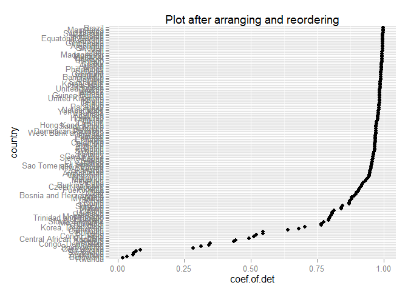

# Homework 05: Factor and figure management; Repo hygiene
Shenyi Pan  


##Goal of this homework

* Reorder a factor in a principled way based on the data and demonstrate the effect in arranged data and in figures.
* Remake at least one previously made figure, in light of recent coverage of visualization design principles.
* Write a figure to file explicitly and include it in the R Markdown report via ``.
* Clean up the repo.

##Workflow

###Load data and packages
First, I will load the gapminder data, as well as the `dplyr`, `ggplot2`, and `knitr` packages.


```r
library(gapminder)
suppressPackageStartupMessages(library(dplyr))
library(ggplot2)
library(knitr)
```

###Factor management
####Drop Oceania
In this part, I will filter the gapminder data to remove observations associated with the continent of Oceania. But first I will take a look at the structure of the original data set.


```r
str(gapminder)
```

```
## 'data.frame':	1704 obs. of  6 variables:
##  $ country  : Factor w/ 142 levels "Afghanistan",..: 1 1 1 1 1 1 1 1 1 1 ...
##  $ continent: Factor w/ 5 levels "Africa","Americas",..: 3 3 3 3 3 3 3 3 3 3 ...
##  $ year     : num  1952 1957 1962 1967 1972 ...
##  $ lifeExp  : num  28.8 30.3 32 34 36.1 ...
##  $ pop      : num  8425333 9240934 10267083 11537966 13079460 ...
##  $ gdpPercap: num  779 821 853 836 740 ...
```

It can be seen that there are 1704 observations in the original data set. Also, the factor `country` has 142 levels, while the factor `continent` has 5 levels including Oceania. Now I will drop the rows from the continent of Oceania.


```r
gapminderNoOceania <- gapminder %>% filter(continent != "Oceania") %>% droplevels()
str(gapminderNoOceania)
```

```
## 'data.frame':	1680 obs. of  6 variables:
##  $ country  : Factor w/ 140 levels "Afghanistan",..: 1 1 1 1 1 1 1 1 1 1 ...
##  $ continent: Factor w/ 4 levels "Africa","Americas",..: 3 3 3 3 3 3 3 3 3 3 ...
##  $ year     : num  1952 1957 1962 1967 1972 ...
##  $ lifeExp  : num  28.8 30.3 32 34 36.1 ...
##  $ pop      : num  8425333 9240934 10267083 11537966 13079460 ...
##  $ gdpPercap: num  779 821 853 836 740 ...
```

It can be seen that after removing the data from Oceania and dropping the corresponding factor levels, there are 1680 observations remaining in the data set. Also, the factor `country` now has 140 levels, while the factor `continent` now has 4 levels. I will make some plots and tables to better illustrate this.


```r
kable(t(as.matrix(summary(gapminder$continent))), format="markdown")
```


| Africa| Americas| Asia| Europe| Oceania|
|------:|--------:|----:|------:|-------:|
|    624|      300|  396|    360|      24|

```r
kable(t(as.matrix(summary(gapminderNoOceania$continent))), format="markdown")
```


| Africa| Americas| Asia| Europe|
|------:|--------:|----:|------:|
|    624|      300|  396|    360|

```r
gapSummary <- gapminder %>% group_by(continent) %>% summarize(n = n())
gapNoOceSummary <- gapminderNoOceania %>% group_by(continent) %>% summarize(n = n())
ggplot(aes(x=continent, y=n, fill=continent), data=gapSummary) + geom_bar(stat="identity") + 
  xlab("continent") +ylab("number of countries") + 
  ggtitle("Number of countries in each continent before filtering")
```

 

```r
ggplot(aes(x=continent, y=n, fill=continent), data=gapNoOceSummary) + geom_bar(stat="identity") + 
  xlab("continent") +ylab("number of countries") + 
  ggtitle("Number of countries in each continent after filtering")
```

 

From the above figures, it can be clearly seen that all the countries from Oceania are dropped in the new data set, while countries in other continents are not affected.

####Reorder the levels of `country`

In this part, I will reorder the levels of the factor `country` and examine its effect on making plots of the given data set. I will use the linear regression function that was written in [Homework 04](https://github.com/STAT545-UBC/shenyi_pan/blob/master/Homework04/Homework04.md), and reorder the factor `country` based on the coefficient of determination obtained from fitting a linear regression model of life expectancy against year for each country.


```r
#Function that was written in Homework 4
linearModel <- function (dat, offset = 1952){
  stopifnot(is.data.frame(dat))
  linMod <- lm(lifeExp ~ I(year - offset), data = dat)
  maxRes <-  max(abs(linMod$residuals))
  maxResYear <- offset - 5 + 5*which.max(abs(linMod$residuals))
  R2 <- summary(linMod)$r.squared
  returnDat <- c(linMod$coef, maxRes, maxResYear, R2)
  return(setNames(data.frame(t(returnDat)), c("intercept", "slope", "max.abs.res", "res.year", "coef.of.det")))
}
coefDet <- gapminder %>%
  group_by(continent, country) %>% 
  do(linearModel(.)) %>%
  ungroup() %>%
  select(country, coef.of.det)
head(coefDet)
```

```
## Source: local data frame [6 x 2]
## 
##        country coef.of.det
##         (fctr)       (dbl)
## 1      Algeria   0.9851172
## 2       Angola   0.8878146
## 3        Benin   0.9666020
## 4     Botswana   0.0340234
## 5 Burkina Faso   0.9187105
## 6      Burundi   0.7659960
```

First, we will make a default plot.

```r
ggplot(aes(y = country), data=coefDet) + geom_point(aes(x = coef.of.det)) + 
    ggtitle("Default plot")
```

 

Next, I will look into the effects of the function `arrange()` and `reorder()`. First, we will arrange the data by the regression coefficient of determination.


```r
coefDetArranged <- coefDet %>% arrange(coef.of.det)
head(coefDetArranged)
```

```
## Source: local data frame [6 x 2]
## 
##     country coef.of.det
##      (fctr)       (dbl)
## 1    Rwanda  0.01715964
## 2  Botswana  0.03402340
## 3  Zimbabwe  0.05623196
## 4    Zambia  0.05983644
## 5 Swaziland  0.06821087
## 6   Lesotho  0.08485635
```

It can be seen that after arranging, the data set is now sorted in a ascending order of the coefficient of determination. I will make another plot to see what will happen.


```r
ggplot(aes(y = country), data=coefDetArranged) + geom_point(aes(x = coef.of.det)) + 
    ggtitle("Plot after arranging")
```

 

The plot is exactly the same as the previous plot we made. Clearly, `arrange()` merely sort the data in a ascending order of coefficient of determination, but does not really have any effects on the plot we make. So we will try to use the function `reorder()` instead.


```r
coefDetReordered <- coefDet %>% mutate(country = reorder(country, coef.of.det))
head(coefDetReordered)
```

```
## Source: local data frame [6 x 2]
## 
##        country coef.of.det
##         (fctr)       (dbl)
## 1      Algeria   0.9851172
## 2       Angola   0.8878146
## 3        Benin   0.9666020
## 4     Botswana   0.0340234
## 5 Burkina Faso   0.9187105
## 6      Burundi   0.7659960
```

```r
ggplot(aes(y = country), data=coefDetReordered) + geom_point(aes(x = coef.of.det)) + 
    ggtitle("Plot after reordering")
```

 

It can be seen that the plot is now ordered in the desired way. But the data is not displayed in an ordered way.

Finially, we will try both `arrange()` and `reorder()`.


```r
coefDetBoth <- coefDet %>% arrange(coef.of.det) %>% mutate(country = reorder(country, coef.of.det))
head(coefDetBoth)
```

```
## Source: local data frame [6 x 2]
## 
##     country coef.of.det
##      (fctr)       (dbl)
## 1    Rwanda  0.01715964
## 2  Botswana  0.03402340
## 3  Zimbabwe  0.05623196
## 4    Zambia  0.05983644
## 5 Swaziland  0.06821087
## 6   Lesotho  0.08485635
```

```r
ggplot(aes(y = country), data=coefDetBoth) + geom_point(aes(x = coef.of.det)) + 
    ggtitle("Plot after arranging and reordering")
```

 

This time, both the table and the plot are ordered in the desired way.

In conclusion, `arrange()` will arrange the order of the table but has no effect on the figure we make. `reorder()` will not arrange the order of the table, but will affect the figure we make. If we apply both the functions `arrange()` and `reorder()`, we can thus obtain an ordered table as well as an ordered figure.

###Visualization design

In this part, I will remake the plot of Asia country's total GDP in [Homework 03](https://github.com/STAT545-UBC/shenyi_pan/blob/master/Homework03/Homework03.md). The original plot looks like this.


```r
gdpInAsia <- gapminder %>% mutate(gdp = pop * gdpPercap) %>% 
  filter(continent == 'Asia') %>% arrange(year) %>% group_by(year) %>% 
  mutate(gdp_rank = min_rank(gdp), gdp_desc_rank = min_rank(desc(gdp))) %>% 
  filter(min_rank(desc(gdp)) < 2 | min_rank(gdp) < 2) %>% 
  select(country, year, pop, gdpPercap, gdp, gdp_desc_rank)
#Original plot
ggplot(gapminder %>% mutate(gdp = pop * gdpPercap) %>% filter(country == "China" | country == "Japan" | country == "Mongolia")) + 
  geom_line(aes(x = year, y = gdp, color = country)) + geom_point(aes(x = year, y = gdp, color = country))
```

 

In the new plot, I will select more countries (i.e., China, Japan, Mongolia, India, Indonesia, Hong Kong SAR, as well as Republic of Korea) from the original data set. Then I will use the size of the circle in the point plot to reflect the GDP per capita of each country. Also, I will change the background color from grey to white to make the grah clearer. The new plot is shown below.


```r
#new plot
ggplot(gapminder %>% mutate(gdp = pop * gdpPercap) %>% filter(country == "China" | country == "Japan" | country == "Mongolia" | country == "India" | country == "Indonesia" | country == "Hong Kong, China" | country == "Korea, Rep.")) + 
  geom_line(aes(x = year, y = gdp, color = country)) + 
  geom_point(aes(x = year, y = gdp, color = country, size=gdpPercap), show.legend = FALSE) +
  scale_size_continuous(range=c(2,8)) + 
  theme_bw()
```

 

Let's include the `RColorBrewer` package in the library and try to use a new color scheme in this plot.

```r
#new color scheme Accent
library(RColorBrewer)
ggplot(gapminder %>% mutate(gdp = pop * gdpPercap) %>% filter(country == "China" | country == "Japan" | country == "Mongolia" | country == "India" | country == "Indonesia" | country == "Hong Kong, China" | country == "Korea, Rep.")) + 
  geom_line(aes(x = year, y = gdp, color = country)) + 
  geom_point(aes(x = year, y = gdp, color = country, size=gdpPercap), show.legend = FALSE) +
  scale_size_continuous(range=c(2,8)) + 
  theme_bw() + scale_color_brewer(palette="Accent") + 
  ggtitle("Plot with color set Accent")
```

 

I will try one more color scheme.

```r
#new color scheme Accent
library(RColorBrewer)
ggplot(gapminder %>% mutate(gdp = pop * gdpPercap) %>% filter(country == "China" | country == "Japan" | country == "Mongolia" | country == "India" | country == "Indonesia" | country == "Hong Kong, China" | country == "Korea, Rep.")) + 
  geom_line(aes(x = year, y = gdp, color = country)) + 
  geom_point(aes(x = year, y = gdp, color = country, size=gdpPercap), show.legend = FALSE) +
  scale_size_continuous(range=c(2,8)) + 
  theme_bw() + scale_color_brewer(palette="Set3") + 
  ggtitle("Plot with color Set 3")
```

 


###Writing figures to file

In this part, I will use `ggsave()` to explicitly write a figure to file. I will use the plot of Asian country's GDP change that was generated in the previous part as an example.


```r
p <- ggplot(gapminder %>% mutate(gdp = pop * gdpPercap) %>% filter(country == "China" | country == "Japan" | country == "Mongolia" | country == "India" | country == "Indonesia" | country == "Hong Kong, China" | country == "Korea, Rep.")) + 
  geom_line(aes(x = year, y = gdp, color = country)) + 
  geom_point(aes(x = year, y = gdp, color = country, size=gdpPercap), show.legend = FALSE) +
  scale_size_continuous(range=c(2,8)) + 
  theme_bw()
ggsave("GDPchange.png", p)
```

```
## Saving 7 x 5 in image
```
Now embed the plot in the report using ``. 

So it can be seen that the plot has been successfully included in the report. Next I will modify the arguments of `ggsave()`, such as width, height, resolution or text scaling, to see what will happen.


```r
#Change the width and height
ggsave("GDPchange1.png", p, width=5, height=3)
```


```r
#Change the resolution, increase the scaling
ggsave("GDPchange2.png", p, scale=2, dpi=300)
```

```
## Saving 14 x 10 in image
```


```r
#Change the resolution, decrease the scaling
ggsave("GDPchange3.png", p, scale=.6, dpi=100)
```

```
## Saving 4.2 x 3 in image
```


From the plots above, it can be seen that among the arguments of `ggsave()`, `width` and `height` controls the actual width and height of the plot. `scale` controls the effect of text scaling, while `dpi` controls the resolution of the plot.

Lastly, in consideration of explicit provision of the plot object `p` via `ggsave(..., plot = p)`, I will try the following few examples.


```r
ggsave("GDPchange4.png", p, scale=2)
```

```
## Saving 14 x 10 in image
```
The plot can be successfully saved in the first case.

```r
ggsave(p, "GDPchange4.png", scale=2)
```
However, if we try to switch the order of the plot object and the name of the plot, an error message will show up: `Error in ggsave(p, "GDPchange4.png", scale = 2) : plot should be a ggplot2 plot`. In such case, the explicit provision of the plot object `p` will be useful to make sure `ggsave()` could successfully save the plot in the local directory. 


```r
ggsave(plot=p, "GDPchange4.png", scale=2)
```

```
## Saving 14 x 10 in image
```
This time, the plot is succefully saved.

###Clean up your repo!
This is [my repository](https://github.com/STAT545-UBC/shenyi_pan) after cleaning.

##Relection
By doing this homework, I learned quite a lot about how to manage the faactor variables, and had a better understanding on the difference between `arrange` and `reorder`. Also, I had a chance to try a few techniques that I have learned in class to improve the Visualization design when making plots with `ggplot2`.

Actually, this is my last homework for this course. Throughout the past 7 weeks, my ability to analyze and present data has been greatly improved. I truly believe all the homeworks I have done will serve as a good reference when I encounter similar problems in future.

